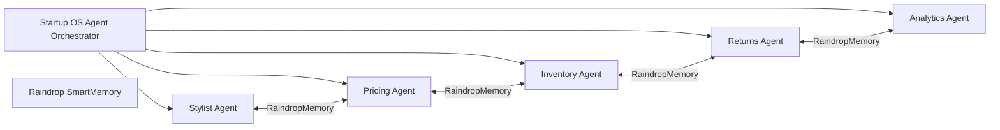
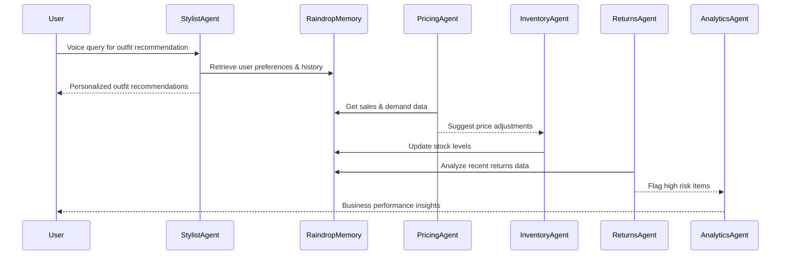

# Style Shepherd Demo - AI-Powered Fashion Startup Operating System

Welcome to the official repo for **Style Shepherd**, an advanced decentralized AI Operating System tailored for fashion startups. This README provides a deep dive into the project's AI architecture, core agent orchestration, system design, and integration approach.

***

## Table of Contents

- [Project Overview](#project-overview)
- [Core AI Architecture](#core-ai-architecture)
- [Multi-Agent System Design](#multi-agent-system-design)
- [Persistent Memory Integration](#persistent-memory-integration)
- [Technical Diagrams](#technical-diagrams)
- [Setup and Development](#setup-and-development)
- [Contact & Contribution](#contact--contribution)

***

## Project Overview

Style Shepherd is not just a shopping assistant—it's a full-fledged AI-driven operating system for small fashion startups. It combines multiple autonomous agents working together to vastly improve operations such as styling recommendations, dynamic pricing, inventory forecasting, returns prevention, and customer analytics.

The system is designed to be a **startup force multiplier**, enabling a small founding team (2-5 members) to operate at enterprise scale with:

- AI Stylist Agent for hyper-personalized fashion recommendations
- Pricing Agent for dynamic, data-driven price optimization
- Inventory Agent for demand forecasting and auto-replenishment
- Returns Agent to predict and prevent high-risk returns before purchase
- Analytics Agent providing actionable business insights

***

## Core AI Architecture

At the heart lies the **StartupOSAgent orchestrator** that coordinates subagents through shared persistent memory (Raindrop SmartMemory). The architecture embraces the latest large language models for natural language processing and combines specialized ML models for real-time predictions.



Each agent runs autonomously, making decisions based on current data and AI predictions, but coordinates via Raindrop to ensure consistency and continuous learning.

***

## Multi-Agent System Design

- **Stylist Agent**: Uses customer profiles and preferences stored in Raindrop to generate personalized fashion recommendations with conversational AI.
- **Pricing Agent**: Implements dynamic pricing strategies informed by demand elasticity, competitor prices, and inventory levels.
- **Inventory Agent**: Forecasts demand and automatically places purchase orders to maintain optimal stock levels.
- **Returns Agent**: Predicts products/orders at high risk for return and triggers intervention workflows.
- **Analytics Agent**: Continuously analyzes KPIs to produce business insights and alerts for founders.

This modularized design allows scaling and separate improvement of individual components without disrupting the ecosystem.

***

## Persistent Memory Integration

**Raindrop SmartMemory** is employed for robust multi-agent state persistence. This memory layer handles:

- Customer style profiles with evolving preferences
- Historical purchase and return data for individual customers and products
- Logs of autonomous decisions for audit and rollback
- Shared context enabling agents to coordinate seamlessly

This memory-centric approach enables *continual learning*, so the AI improves with every interaction.

***

## Technical Diagrams

### Startup OS Agent Data Flow



***

## Setup and Development

### Prerequisites

- Node.js v18+
- pnpm or npm package manager
- Access to OpenAI or custom LLM API keys
- Vultr GPU or equivalent for inference acceleration

### Installation

```bash
git clone https://github.com/lucylow/style-shepherd-demo.git
cd style-shepherd-demo
npm install
npm run dev
```

### Folder Structure Highlights

- `lib/startup-os/`: Core orchestrator and agents’ logic
- `lib/raindrop-smart-memory/`: Persistent multi-agent memory layer
- `components/startup-os/`: UI components for founder dashboard and agent visualizations
- `pages/startup-os/`: Demo pages for showcasing OS in action

***

## Contact & Contribution

For questions, feature requests, or contributions, please open issues or pull requests on GitHub.

The Style Shepherd team welcomes collaboration from AI researchers, fashion-tech innovators, and startup operators to build the future of decentralized AI operating systems for SMBs.

***

*This README emphasizes the project's AI technical depth integrated with modern architecture and clear visualization to impress technical judges and collaborators alike.*

[1](https://github.com/lucylow/style-shepherd-demo)
[2](https://www.youtube.com/watch?v=HJ-NTxs1EjI)
[3](https://github.com/gabyx/Technical-Markdown)
[4](https://experienceleague.adobe.com/en/docs/contributor/contributor-guide/writing-essentials/markdown)
[5](https://dev.to/mdocs/markdown-for-technical-writing-2aeo)
[6](https://docs.github.com/en/contributing/writing-for-github-docs/using-markdown-and-liquid-in-github-docs)
[7](https://markdown-it.github.io)
[8](https://docs.github.com/github/writing-on-github/getting-started-with-writing-and-formatting-on-github/basic-writing-and-formatting-syntax)
[9](https://github.com/adam-p/markdown-here/wiki/markdown-cheatsheet)
[10](https://www.markdownguide.org/getting-started/)
[11](https://github.com/mundimark/awesome-markdown)
